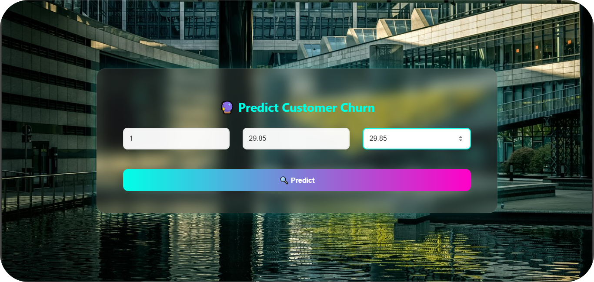
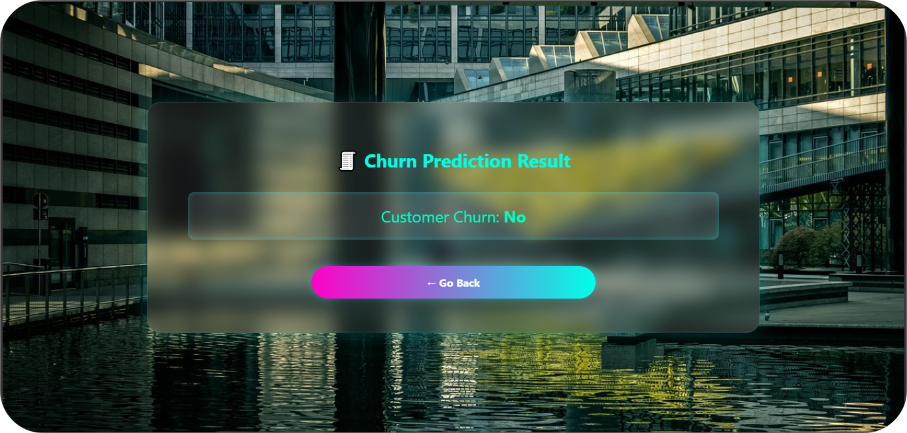

🔮 Customer Churn Prediction Web App

This project is a stylish, AI-powered **Customer Churn Prediction Web Application** built using **Flask**, **Machine Learning**, and a modern **glassmorphic user interface**. It predicts whether a telecom customer is likely to churn based on their usage behavior.

📸 Screenshots

💡 Home (Input Page)

🔍 Prediction Page

🚀 Features

- 🔮 Predicts customer churn using trained machine learning model
- 💅 Beautiful and modern UI with glassy, long-rectangle panels
- 🧠 Built using Python, Flask, and Scikit-learn
- 🎨 Fully customizable HTML/CSS (mobile-friendly)

🛠️ Tech Stack

- Python
- Flask
- Scikit-learn
- Pandas
- HTML5 + CSS3
- Responsive Glassmorphic Design

🧪 How It Works

The user inputs:
   - Tenure
   - Monthly Charges
   - Total Charges
A trained model predicts churn based on these features.
The result is displayed with a smooth, styled interface.

1. Install Requirements

pip install -r requirements.txt

2. Train Model (only once)

python main.py

3. Start Flask App

python app.py

🙌 Acknowledgments

Dataset: Kaggle - Telco Customer Churn

UI Inspiration: Neumorphism & Glassmorphism design
